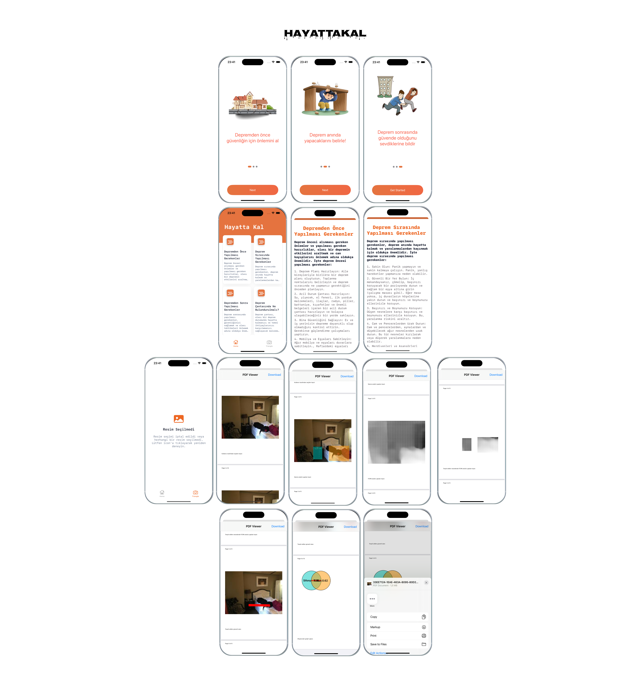

# HayattaKalApp

## Download the [thesis](https://drive.google.com/file/d/1jw6K1Pfp1Cspw3IfmGAWWw_a6zfsyHgb/view?usp=sharing) from the attached link.

### Built With
- [UIKit](https://developer.apple.com/documentation/uikit)
- [Swift](https://developer.apple.com/swift/)

  

It aims to identify the best areas to establish a life triangle during an earthquake.

## Overview
* Uses UIKit
* Uses SwiftUI
* Designed with MVVM pattern
* No External Dependencies
* Universal App: Run on iPhone, iPad, and Mac
